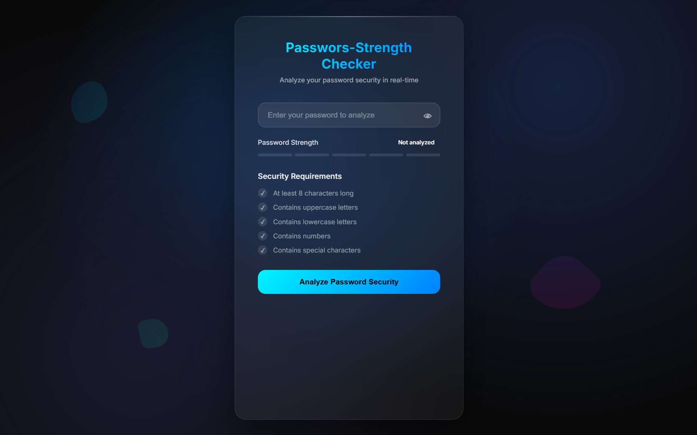
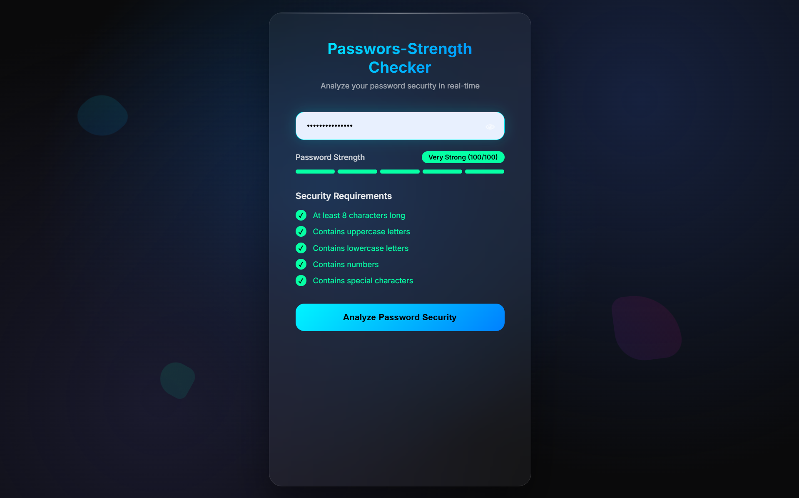

# 🔐 Password-Strength-Checker

A lightweight web app that analyzes the strength of a password using a Python Flask backend and a clean HTML/CSS frontend.

## 🚀 Features

- Real-time password strength checking
- Feedback on weak/strong passwords
- Modern dark-themed UI (like SecureCheck)
- Built using HTML, CSS, and Python (Flask)

## 🖥️ Tech Stack

- **Frontend**: HTML5, CSS3
- **Backend**: Python 3, Flask

## 📁 File Structure

password-strength-checker/
├── static/
│ └── style.css
├── templates/
│ └── index.html
├── main.py
└── README.md

## 📸 Screenshots

